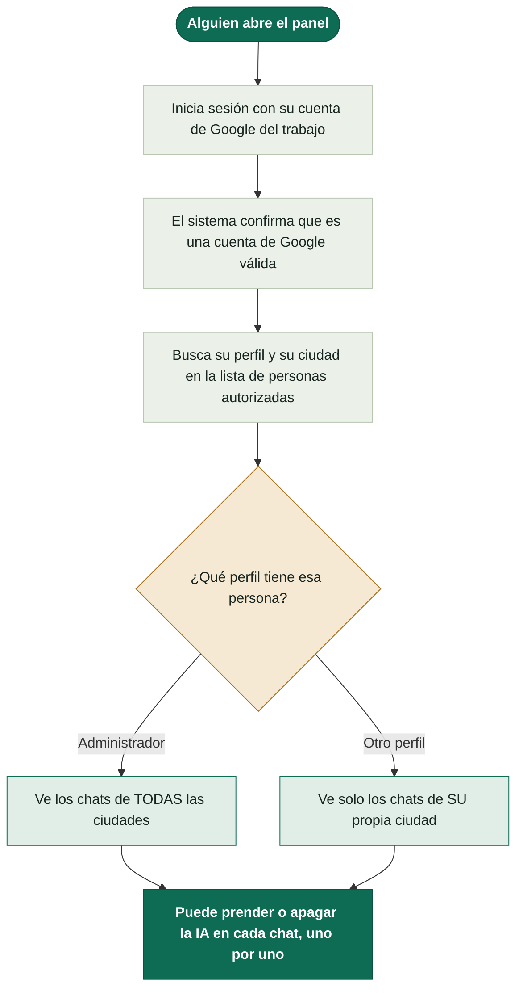

Información sobre el proyecto

## Cómo funciona el sistema

Cada vez que alguien abre el panel, pasa por estos pasos antes de ver cualquier chat:

En palabras simples:

1. **Inicio de sesión** — la persona entra con su cuenta de Google del trabajo, no hay usuario ni contraseña propios que mantener.
2. **Verificación de identidad** — el sistema confirma con Google que la cuenta es real y válida.
3. **Consulta de perfil y zona** — el sistema busca esa persona en la lista interna de autorizados y le asigna su perfil (Administrador u otro) y su ciudad.
4. **Según el perfil** — un Administrador ve los chats de todas las ciudades; cualquier otro perfil ve únicamente los de su propia ciudad.
5. **En cualquiera de los dos casos** — la persona puede, chat por chat, prender o apagar que la IA responda automáticamente.

